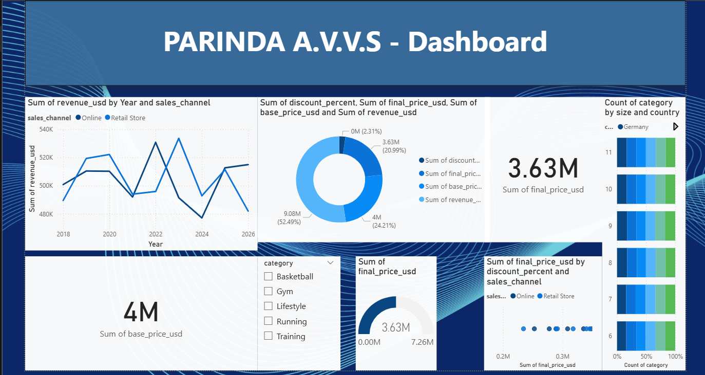

# Global Sports Footwear Sales Analysis (2018-2026)

This project provides a comprehensive analysis of global sports footwear sales, featuring key metrics like revenue, unit sales, and customer ratings across different brands and regions.

## 📊 Dashboard Preview

## 📂 Project Contents
* **Parinda A.V.V.S.pbix**: The main Power BI Desktop file.
* **global_sports_footwear_sales_2018_2026.csv**: The dataset used for analysis.
* **[Project_Report.pdf](Project_Report.pdf)**: Full documentation and insights in PDF format. (Click to view)
* **dashboard_preview.png.png**: Visual preview of the analytics dashboard.

## 🚀 Key Insights
* **Sales Trends**: Comprehensive analysis of sales performance from 2018 to 2026.
* **Brand Comparison**: Performance metrics for major brands including Nike, Adidas, Puma, and more.
* **Customer Demographics**: Insights into consumer behavior, income levels, and regional channel preferences.

## 📄 Project Report
Detailed analysis and methodology are documented in the project report.
👉 **[Click here to open the PDF Report](Project_Report.pdf)**

## 🛠️ How to View
1. Download the `.pbix` file and the `.csv` dataset.
2. Open the project using **Power BI Desktop**.
3. Ensure both files are in the same directory if you need to refresh the data connection.

---
*Developed by Parinda A.V.V.S*
